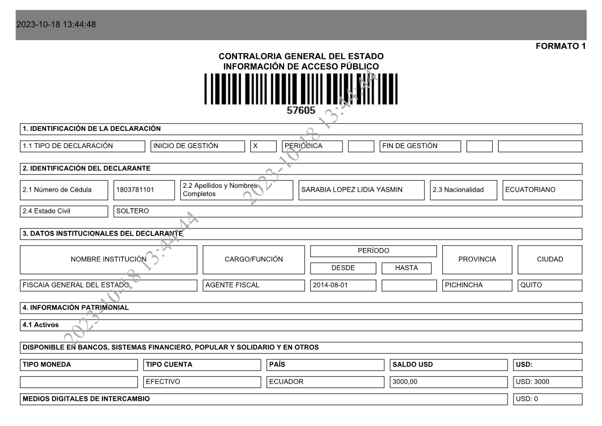

# Text Extraction From Images

This repo shows how to extract information from forms saved as images. For example,



and get structured data from it:
```python
# Data Output
{'cargo': 'AGENTE FISCAL 2014-08-01',
 'ciudad': '‘Quito',
 'civil': '‘SOLTERO',
 'desde': '2014-08-01',
 'gestion': 'INICIO DE GESTION     x PERIODICA             FIN DE GESTION          ',
 'hasta': '',
 'institucion': 'FISCAIA GENERAL DEL ESTADO, AGENTE ‘4. INFORMACION PATRIMONIAL',
 'prov': 'PICHINCHA,'}
```

I show examples using two OCR agents Tesseract and [Google Cloud Vision](https://cloud.google.com/vision?hl=en).

 - Tesseract is free. To install follow the instructions in its [own repo](https://github.com/tesseract-ocr/tesseract).
 - Google Cloud Vision is free for the first 1k images, then it runs on a pay-per-use base. For instructions on the installation follow this [link](https://cloud.google.com/vision/docs).